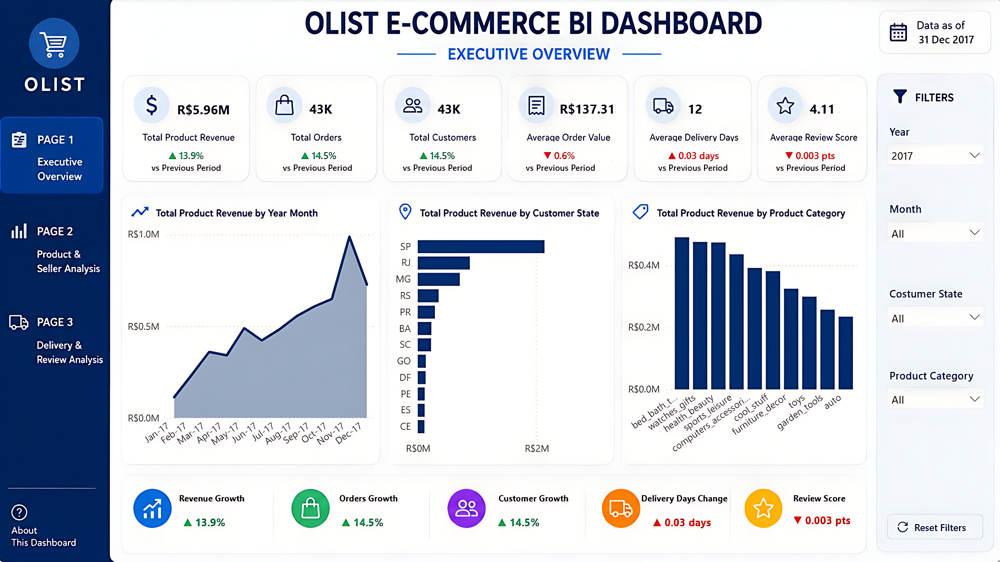
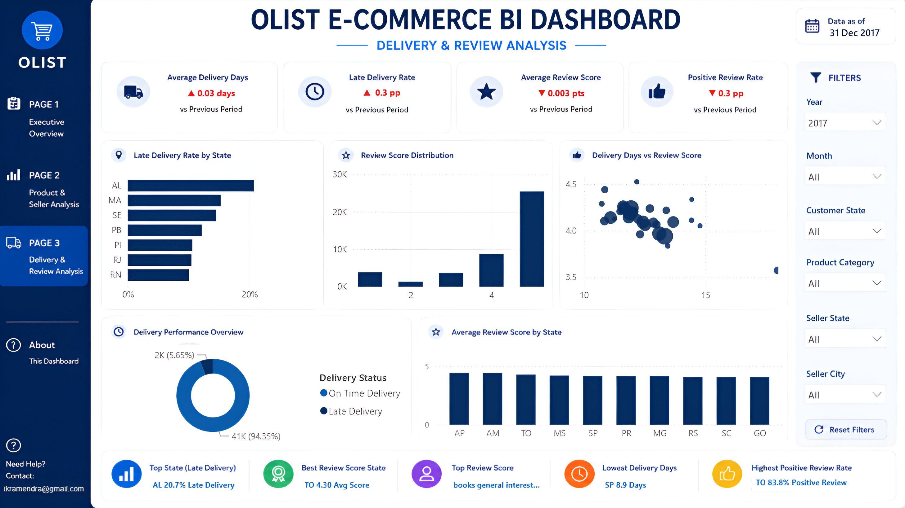
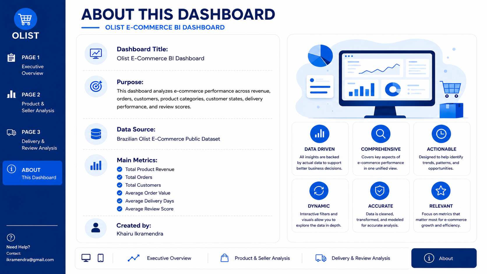

# Olist E-Commerce BI Analytics Case Study

## 1. Background

Olist is a Brazilian e-commerce platform that connects sellers with customers across multiple regions. The dataset contains information about orders, products, sellers, payments, delivery timelines, customers, and review scores.

This case study analyzes e-commerce business performance using an end-to-end Business Intelligence workflow, starting from raw CSV files, data quality checks, data cleaning, SQLite database creation, SQL-based analysis, and Power BI dashboard development.

The project was built as a portfolio project to demonstrate practical Data Analyst and BI Analyst skills.

---

## 2. Business Problem

E-commerce businesses need to continuously monitor revenue performance, order volume, product category performance, seller contribution, delivery efficiency, and customer satisfaction.

Without a structured BI workflow, business users may face several problems:

* Difficulty tracking revenue trends over time
* Limited visibility into top-performing product categories
* Unclear seller and customer location performance
* Difficulty identifying delivery delay issues
* Lack of connection between delivery performance and customer review scores
* Limited ability to turn raw operational data into business insights

This project addresses those problems by transforming raw e-commerce data into structured analytical tables and visualizing key business metrics through an interactive Power BI dashboard.

---

## 3. Business Questions

This case study focuses on the following business questions:

1. What is the overall revenue, order, customer, delivery, and review performance?
2. How does product revenue change over time?
3. Which product categories generate the highest revenue?
4. Which product categories sell the most items?
5. Which customer states contribute the most to revenue?
6. Which seller states contribute the most to revenue?
7. How efficient is the delivery process?
8. Which states have the highest late delivery rate?
9. How are delivery performance and customer review scores related?
10. Which product and seller segments should be prioritized?

---

## 4. Data Source

The dataset used in this project is the Brazilian E-Commerce Public Dataset by Olist from Kaggle.

The dataset contains multiple relational tables, including:

| Table                          | Description                                   |
| ------------------------------ | --------------------------------------------- |
| `orders`                       | Order status and order timeline               |
| `order_items`                  | Product-level transaction data                |
| `order_payments`               | Payment method and payment value              |
| `order_reviews`                | Customer review score and review comment data |
| `customers`                    | Customer location data                        |
| `products`                     | Product category and product attributes       |
| `sellers`                      | Seller location data                          |
| `product_category_translation` | English translation for product categories    |
| `geolocation`                  | Geographical location reference data          |

Raw data is not uploaded to this repository due to file size and reproducibility reasons.

---

## 5. Methodology

The project was developed using the following workflow:

```text
Raw CSV Files
      ↓
Data Quality Check
      ↓
Data Cleaning & Transformation
      ↓
SQLite Database Creation
      ↓
SQL Business Analysis
      ↓
Power BI Analytical Tables
      ↓
Power BI Dashboard
      ↓
Business Insights & Recommendations
```

This workflow simulates a real-world BI process where raw operational data is cleaned, modeled, analyzed, and visualized for business decision-making.

---

## 6. Data Quality Process

Before performing analysis, the raw datasets were checked to understand their structure, completeness, and reliability.

The data quality process included:

* Checking table row counts
* Checking column counts
* Checking missing values
* Checking duplicate rows
* Checking primary key uniqueness
* Checking relationship consistency between tables
* Reviewing date columns and numeric columns
* Identifying tables required for business analysis

The purpose of this process was to make sure that the data could be safely transformed into analytical tables.

---

## 7. Data Cleaning and Transformation

The data cleaning process focused on preparing the dataset for SQL analysis and Power BI reporting.

Main cleaning and transformation steps included:

* Converted order date columns into datetime format
* Removed exact duplicate rows
* Standardized city and state values
* Added English product category names
* Created delivery duration metrics
* Created late delivery flag
* Created item-level revenue columns
* Created year, month, and year-month columns
* Prepared analytical fact and dimension tables for Power BI

Important generated columns:

| Column                      | Description                                                         |
| --------------------------- | ------------------------------------------------------------------- |
| `delivery_days`             | Number of days between purchase date and customer delivery date     |
| `estimated_delivery_days`   | Number of days between purchase date and estimated delivery date    |
| `delivery_delay_days`       | Difference between actual delivery date and estimated delivery date |
| `is_late_delivery`          | Flag to identify whether an order was delivered late                |
| `total_item_value`          | Product revenue plus freight value                                  |
| `product_revenue`           | Product-level revenue excluding freight                             |
| `order_purchase_year`       | Year extracted from order purchase date                             |
| `order_purchase_month`      | Month extracted from order purchase date                            |
| `order_purchase_year_month` | Year-month label for time-based analysis                            |

---

## 8. Database and SQL Analysis

After cleaning, the datasets were loaded into a SQLite database.

The SQL analysis focused on:

* KPI overview
* Monthly revenue trend
* Product category performance
* Customer location analysis
* Payment analysis
* Delivery and review analysis

This approach allows the project to follow a more realistic BI workflow, where analysts work with structured databases instead of only analyzing CSV files directly.

SQL queries were created to support business analysis and to prepare datasets for reporting.

---

## 9. Power BI Data Model

A star schema model was prepared for Power BI.

```text
             dim_date
                |
dim_products — fact_sales — dim_customers
                |
            dim_sellers
```

The main fact table is `fact_sales`, which stores order item-level transaction data.

Dimension tables used in the dashboard:

* `dim_date`
* `dim_products`
* `dim_customers`
* `dim_sellers`

Relationships:

| Dimension Table              | Fact Table                |
| ---------------------------- | ------------------------- |
| `dim_date[order_date]`       | `fact_sales[order_date]`  |
| `dim_products[product_id]`   | `fact_sales[product_id]`  |
| `dim_customers[customer_id]` | `fact_sales[customer_id]` |
| `dim_sellers[seller_id]`     | `fact_sales[seller_id]`   |

This model helps keep the dashboard cleaner, easier to maintain, and more scalable for analysis.

---

## 10. Key Metrics

The dashboard uses several key business metrics:

| Metric                | Formula / Logic                                         |
| --------------------- | ------------------------------------------------------- |
| Total Product Revenue | Sum of product revenue                                  |
| Total Freight Value   | Sum of freight value                                    |
| Total Sales Value     | Product revenue plus freight value                      |
| Total Orders          | Distinct count of order ID                              |
| Total Customers       | Distinct count of customer ID                           |
| Total Sellers         | Distinct count of seller ID                             |
| Total Items Sold      | Count of order item rows                                |
| Average Order Value   | Total Product Revenue divided by Total Orders           |
| Average Delivery Days | Average number of days from purchase to delivery        |
| Late Delivery Rate    | Late delivery orders divided by total orders            |
| Positive Review Rate  | Orders with review score 4 or 5 divided by total orders |
| Average Review Score  | Average customer review score                           |

---

## 11. Dashboard Overview

The Power BI dashboard consists of four pages:

### Page 1: Executive Overview

This page provides a high-level business summary.

Main components:

* Total Product Revenue
* Total Orders
* Total Customers
* Average Order Value
* Average Delivery Days
* Average Review Score
* Monthly revenue trend
* Revenue by customer state
* Revenue by product category
* Growth indicators compared to previous period



---

### Page 2: Product & Seller Analysis

This page focuses on product and seller performance.

Main components:

* Revenue by product category
* Items sold by product category
* Product revenue vs freight value
* Revenue by seller state
* Top product category table
* Top seller state
* Top seller
* Highest AOV category
* Highest items sold category


---

### Page 3: Delivery & Review Analysis

This page focuses on delivery performance and customer satisfaction.

Main components:

* Average delivery days
* Late delivery rate
* Average review score
* Positive review rate
* Late delivery rate by state
* Review score distribution
* Delivery days vs review score
* Delivery performance overview
* Average review score by state



---

### Page 4: About This Dashboard

This page explains the dashboard purpose, data source, main metrics, and analysis value.



---

## 12. Business Insights

Based on the dashboard design and analysis framework, the project helps identify the following insights:

1. Revenue performance can be monitored over time using monthly trend analysis.
2. Certain product categories contribute significantly more revenue than others.
3. Product categories with high item sales are not always the same as product categories with the highest revenue.
4. Seller performance is concentrated in specific seller states.
5. Customer location analysis helps identify states with stronger revenue contribution.
6. Delivery delay can be monitored using late delivery rate and delivery days.
7. Review score distribution helps evaluate customer satisfaction patterns.
8. Delivery performance and review score can be analyzed together to identify potential service quality issues.
9. Product categories with high freight value may require further shipping cost analysis.
10. The dashboard allows business users to filter by year, month, customer state, product category, seller state, and seller city.

---

## 13. Business Recommendations

Based on the BI analysis framework, the business could take the following actions:

1. Prioritize high-revenue product categories for marketing, sales strategy, and inventory planning.
2. Monitor product categories with high order volume but lower revenue contribution to understand pricing and margin opportunities.
3. Analyze seller states with strong revenue contribution to identify operational best practices.
4. Investigate states with high late delivery rates to improve logistics performance.
5. Track delivery days and late delivery rate regularly to prevent customer satisfaction issues.
6. Use review score trends to identify product or delivery-related service problems.
7. Optimize shipping strategy for categories with high freight contribution.
8. Use monthly revenue trend analysis to support demand planning and forecasting.
9. Evaluate top sellers for potential partnership, retention, or performance improvement programs.
10. Use dashboard filters to support more specific regional and product-level business analysis.

---

## 14. Skills Demonstrated

This project demonstrates the following technical and analytical skills:

* Python data processing
* Data quality checking
* Data cleaning and transformation
* SQLite database creation
* SQL business analysis
* Analytical table preparation
* Star schema data modeling
* Power BI dashboard development
* DAX measure creation
* KPI design
* Interactive filter design
* Business insight communication
* End-to-end project documentation
* Portfolio project presentation

---

## 15. Limitations

This project has several limitations:

* The analysis is based on historical public dataset records.
* The dashboard focuses on descriptive and diagnostic analytics, not predictive modeling.
* Raw data and Power BI file may not be included in the repository due to file size and reproducibility considerations.
* Business recommendations are based on available dataset features and dashboard-level analysis.
* Further analysis could include customer segmentation, seller performance scoring, delivery prediction, and product-level profitability modeling.

---

## 16. Future Improvements

Potential improvements for this project include:

* Add customer segmentation analysis
* Add seller performance scorecard
* Add profitability analysis if cost data is available
* Add delivery delay prediction model
* Add product category clustering
* Add Power BI drill-through pages
* Add map-based geographic visualization
* Deploy dashboard preview using Power BI Service
* Create an executive PDF report for business stakeholders

---

## 17. Conclusion

This project demonstrates an end-to-end Business Intelligence workflow using Python, SQL, SQLite, and Power BI.

The project shows how raw e-commerce data can be transformed into structured analytical datasets, analyzed using SQL, modeled using a star schema, and visualized through an interactive Power BI dashboard.

The final dashboard helps stakeholders monitor sales performance, product category performance, seller contribution, delivery efficiency, and customer satisfaction in one unified view.